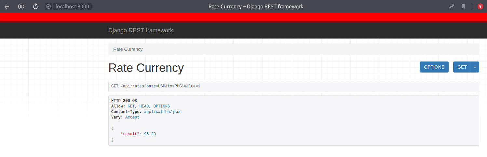
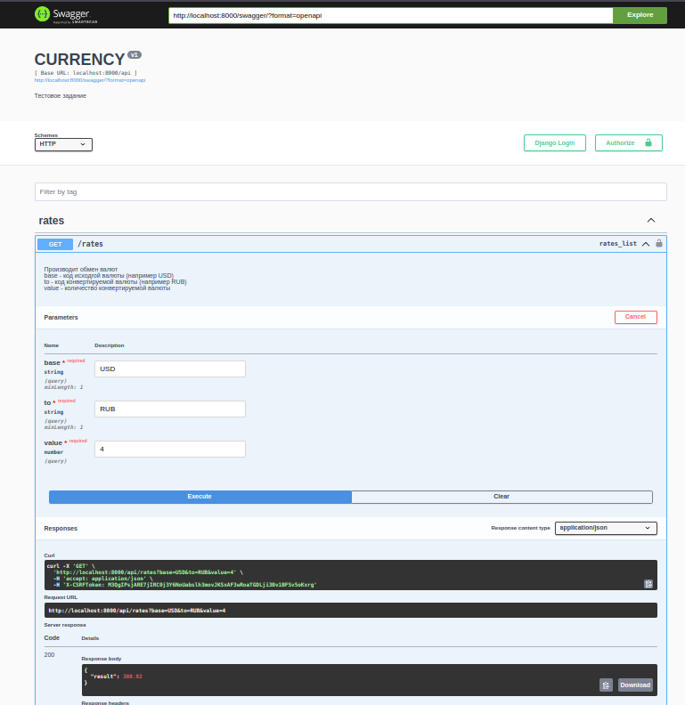

# Тестовое задание HR365

Задание:
Написать сервис "Конвертер валют" который работает по REST-API.

Пример запроса:
GET /api/rates?base=USD&to=RUB&value=1
Ответ:
{
"result": 62.16
}
<ul>
 <li>Любой фреймворк в пределах python.</li>
 <li>Данные о текущих курсах валют необходимо получать с внешнего сервиса.</li>
 <li>Контейнерезация, документация, и прочее — приветствуется.</li>
</ul>

# О проекте

Задание я выполнил с использованием Django, DjangoRestFramework, 
также дополнительно подготовил Docker-контейнер для удобства запуска и включил его в docker-compose для сборки билда и запуска одной командой

Кроме того поднята динамическая документация API в виде SWAGGER

В качестве сервиса обменника курса использовал https://currencyapi.com/

## Запуск проекта на машине

<ul>
 <li>Скопируйте репозитоирий и создайте виртуальное окружение</li>

    git clone https://github.com/Jedi136rus/hr_365_test.git

 <li>Установите все зависимости</li>

    pip install -r requirements.txt

 <li> Запустите проект  </li>

    python manage.py runserver    

</ul>

## Запуск проекта через докер

<ul>
 <li>Скопируйте репозитоирий</li>

    git clone https://github.com/Jedi136rus/hr_365_test.git

 <li>Запустите контейнер</li>

    docker-compose up -d

</ul>

### Далее можено делать запрос по эндпоинту 
http://localhost/api/rates?from=USD&to=RUB&value=1

Для удобства не стал выключать debug

или можно перейти в документацию swagger 

http://localhost:8000/swagger/

